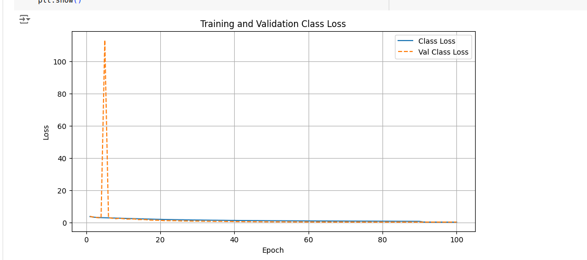
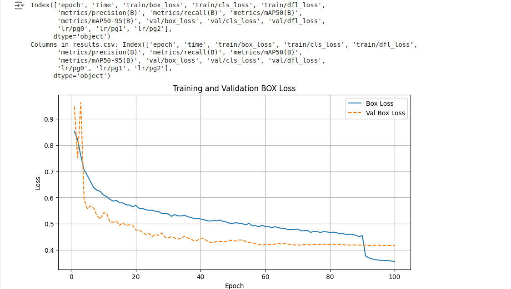
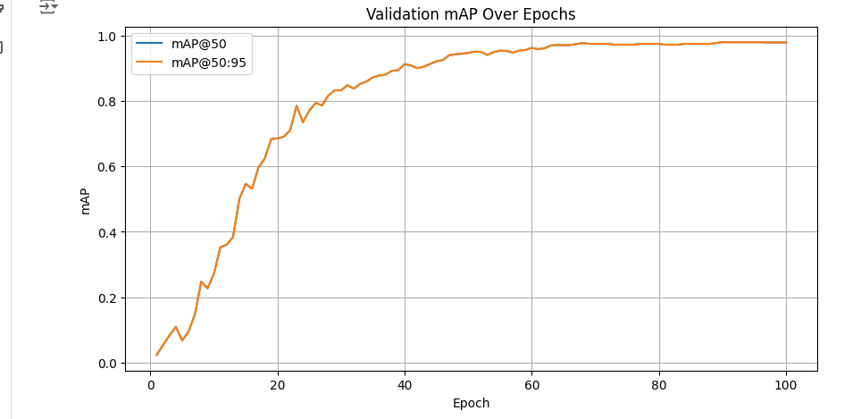
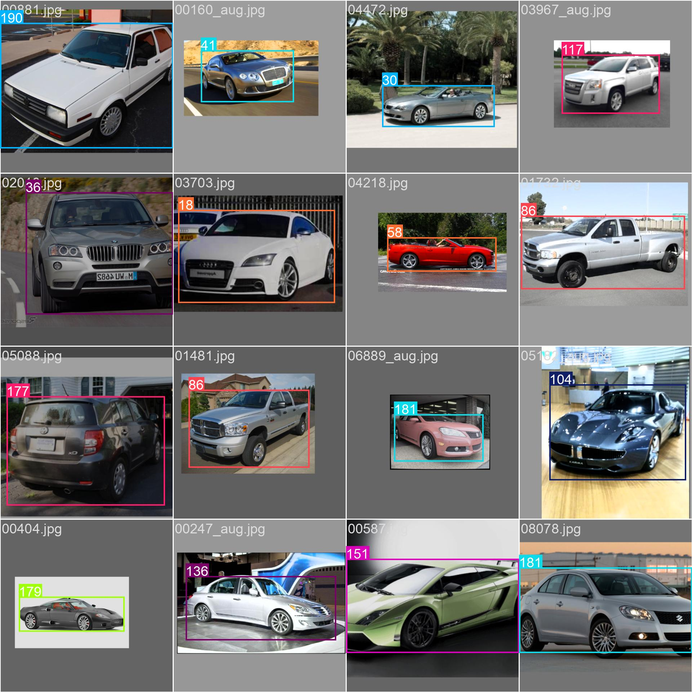
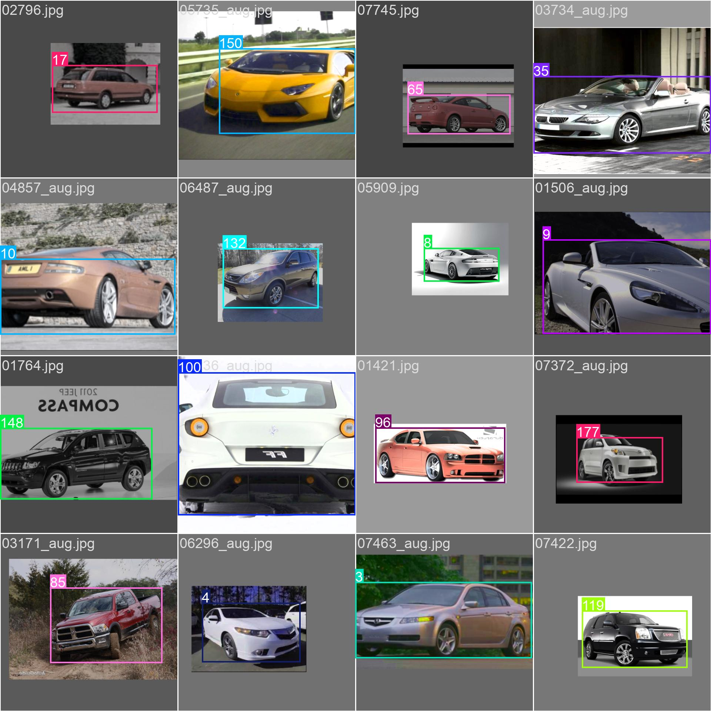
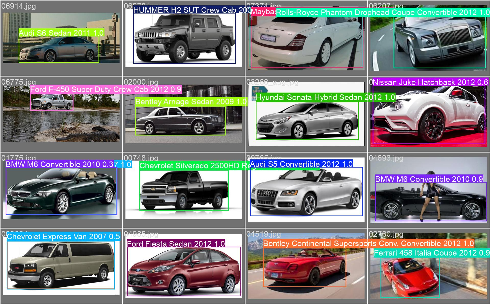
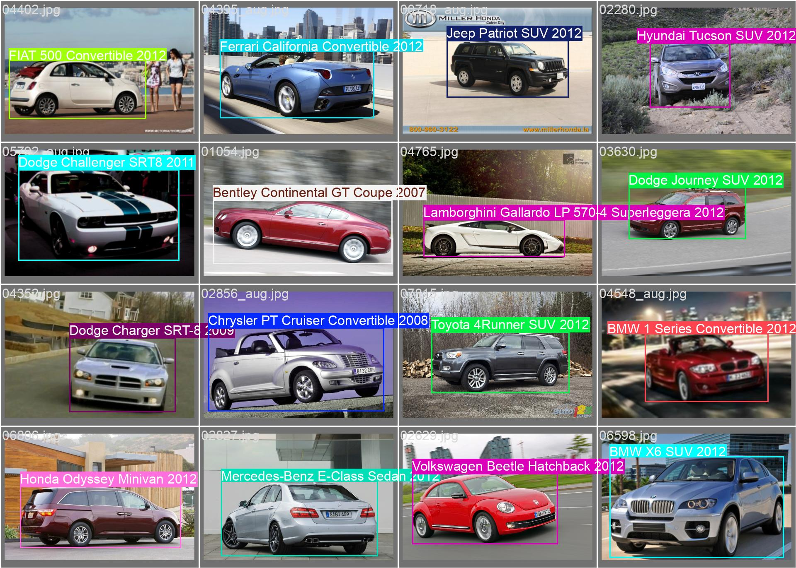
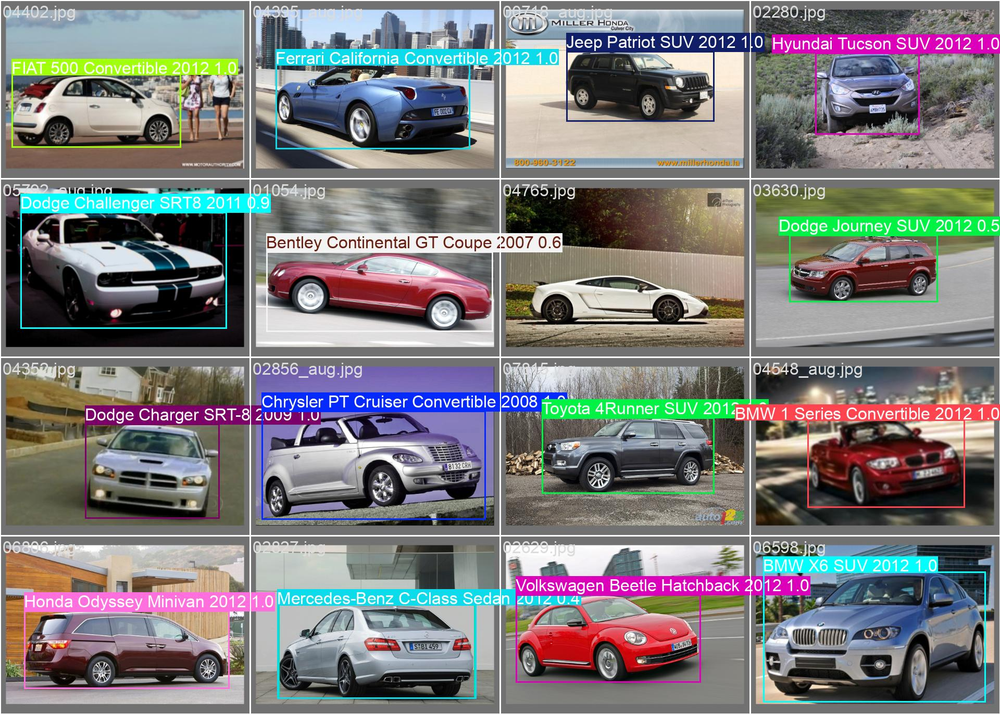

This Repo contains the model for car detection. It is tained using YoloV11

# Analysis
You can check the `CV_Analysis_And_DataPrepration.ipynb`
For class imabalance I have used Albumenations library for generating augmented images.

# Training 
I have used collab for training the model
All the codes are in `Digit_Yolov11_ModelTrain.ipynb`

Training metadata: https://drive.google.com/drive/folders/1-QTh5iMzQlgjoPjkU7goDpiu-hQmZ8Lh?usp=sharing

# Running The Containerize code
1. Ensure Docker is installed, if not install these
    * pip install --upgrade pip
    * pip install ultralytics
    * pip install fastapi==0.99.1 
    * pip install uvicorn==0.25.0        
    * pip install pydantic==1.10.13

    
    
2. Navigate To `carDetection-Containerize/CarDetection`:
    * if docker is installed
        * In terminal run `docker build -t car .`
        * `docker run -p 5005:5005 --name car car`
    * if docker is not installed and you have installed all the dependencies
        * Run `uvicorn app:app --host 0.0.0.0 --port 5005 --workers 1`
3. After this model will start on `port 5005`
4. To test the api, you can navigate to
    * test directory
    * copy image to the test directory
    * In `test.py` change the url and filename and run `python test.py`
    * Output will be save in `test/output`

# For Cpu based  ONNX Model and TFLite Model for mobile
1. You can navigate to mobile_or_cpu, and can use `best.onnx` for cpu
2. For mobile you can use `best_saved_model`, it have tflite model for mobile

# For GPU based model
You can navigate to `tensorrt_for_gpu` and use the `best.engine` model

# For Test Images, you can see the test reult on 
https://drive.google.com/drive/folders/1k6SXXv1grz3OhM8cIbbQCIx-LscQK-3Q?usp=sharing

# Class Loss
The classification loss reduces very quickly, indicating efficient learning. The low loss values after stabilization mean the model is performing well in predicting class labels. The close alignment between training and validation loss demonstrates that the model generalizes well to unseen data without significant overfitting.

# Box Loss
The validation box loss stabilizes early, indicating that the model achieves good generalization for bounding box predictions.
Training Dynamics:

The training loss keeps decreasing, showing the model continues to optimize its predictions on the training set.

The final box loss values are low for both training (~0.36) and validation (~0.42), which suggests that the model predicts bounding boxes accurately.

Since the training and validation box losses remain close throughout the training process, there is no significant overfitting.

# Validation Over Map

mAP@50 (Blue) reaches a near-perfect value, indicating high performance at IoU=0.50. mAP@50:95 (Orange) is slightly more challenging but still stabilizes at a high value, suggesting the model generalizes well across IoU thresholds.

# Model Batch Predictions

